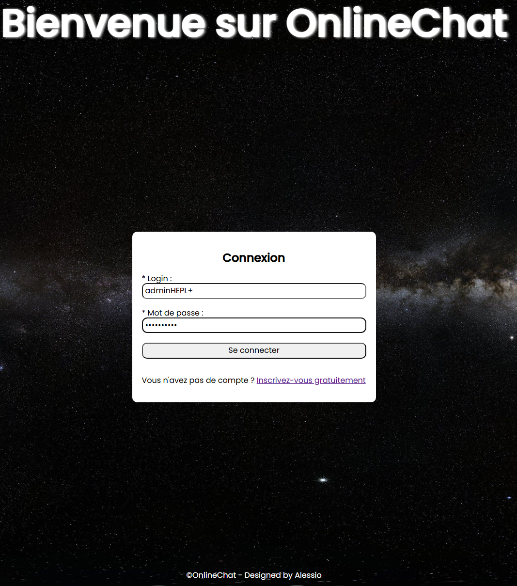
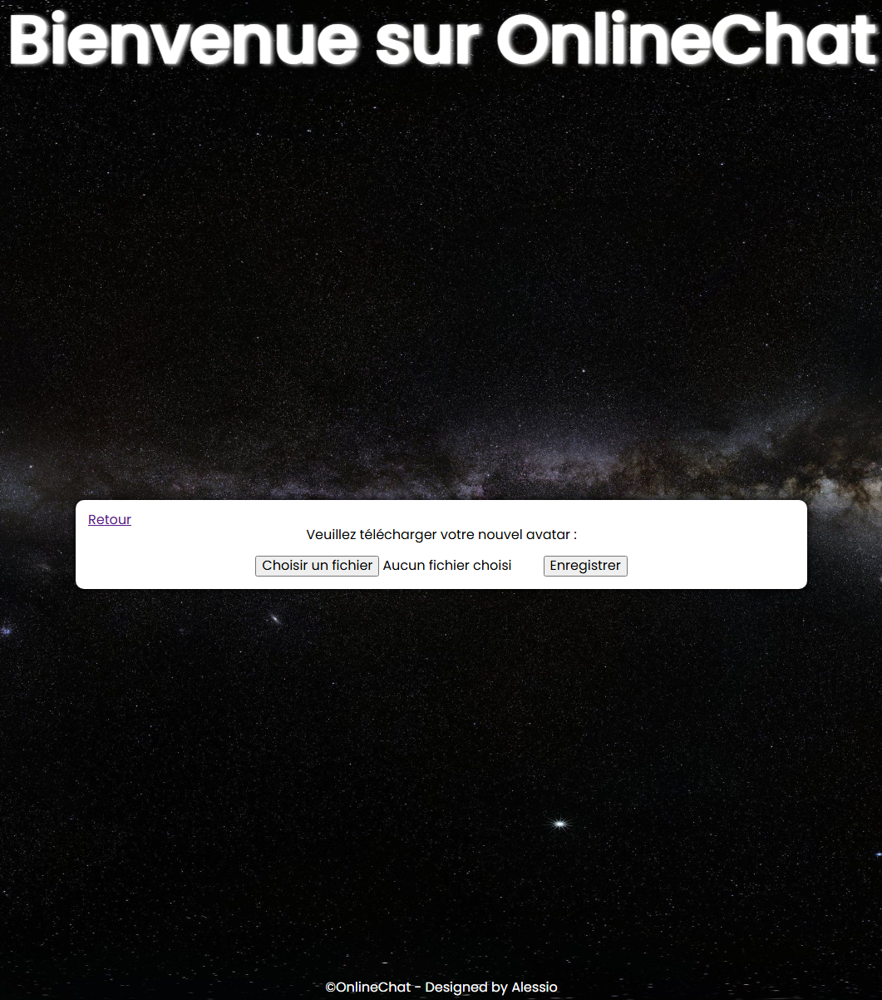
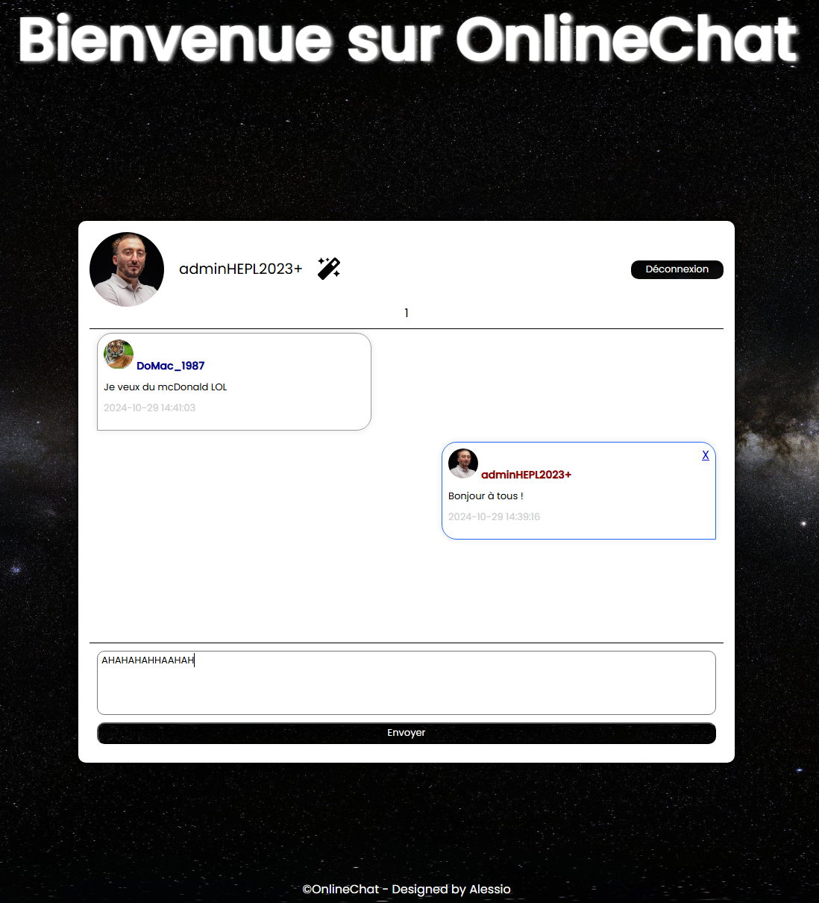

# OnlineChat

OnlineChat est une application web de chat permettant aux utilisateurs de se connecter, de créer un compte et d’échanger des messages avec les autres utilisateurs connectés. Une fois connecté, chaque utilisateur peut accéder à une page de personnalisation pour ajouter une photo de profil.

## 📋 Table des matières
1. [Aperçu du Projet](#aperçu-du-projet)
2. [Fonctionnalités](#fonctionnalités)
3. [Technologies Utilisées](#technologies-utilisées)
4. [Prérequis](#prérequis)
5. [Installation et Configuration](#installation-et-configuration)
6. [Utilisation](#utilisation)
7. [Contribuer](#contribuer)
8. [Licence](#licence)
9. [Demonstration](#-demonstration)

## 🔍 Aperçu du Projet
OnlineChat est un projet de messagerie en ligne développé en HTML, CSS, et PHP avec une base de données pour la gestion des utilisateurs. Il est conçu pour une interaction utilisateur simplifiée, permettant à chacun de se connecter et de discuter en temps réel. 

<!-- Image ici -->

## ✨ Fonctionnalités
- **Inscription et Connexion** : Les utilisateurs peuvent créer un compte et se connecter. Les informations sont stockées dans une base de données.
- **Chat en temps réel** : Les utilisateurs connectés peuvent envoyer et recevoir des messages.
- **Page de personnalisation** : Chaque utilisateur peut accéder à une page dédiée pour télécharger une photo de profil.
- **Système de session** : Gestion des sessions utilisateurs pour maintenir l’état de connexion.


## 🛠️ Technologies Utilisées
- **Frontend** : HTML5, CSS3
- **Backend** : PHP
- **Base de données** : MySQL ou MariaDB 

## 📋 Prérequis
Avant de commencer, assurez-vous d’avoir un serveur web compatible installé sur votre machine.
Pour tester le projet en local sur votre machine vous devez disposez :

- Pour **macOS** : Mamp
- Pour **Windows** : Wamp ou EasyPHP


## 🚀 Installation

### 1. Cloner le dépôt
```bash
git clone https://github.com/votre-utilisateur/OnlineChat.git
```

## 👀 Demonstration








